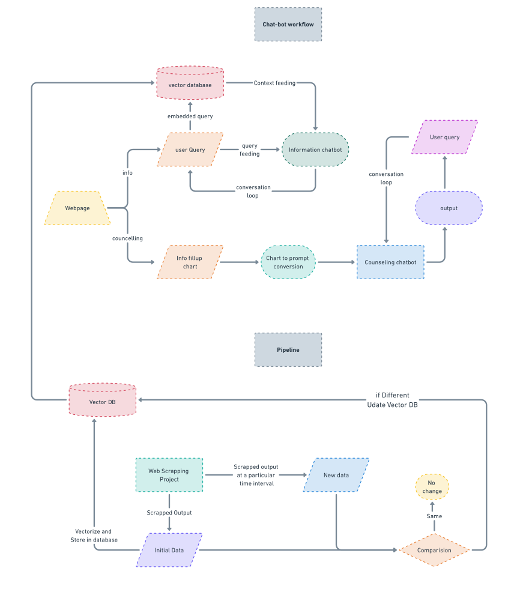

# Automated Web Scraping and Data Ingestion for RAG LLM Model

This project automates the process of web scraping, data processing, and vector database management using Apache Airflow. The scraped data is used to create a vector database that feeds a Retrieval-Augmented Generation (RAG) Large Language Model (LLM), enabling it to use the most recent data for contextual responses.

## Project Overview



The project involves the following key steps:

1. **Web Scraping**: Data is scraped from a college website using Scrapy.
2. **Data Change Detection**: The newly scraped data is compared with previous versions to detect any changes.
3. **Vectorization**: If changes are detected, the data is vectorized and stored in a vector database.
4. **Vector Database Management**: The vector database is updated and made available for the LLM to use as context.
5. **Airflow Automation**: The entire workflow is managed and scheduled using Apache Airflow.

## Project Structure
```bash
├── dags/
│   └── web_scraping_pipeline.py       # Airflow DAG for the entire workflow
├── scrapy_project/
│   ├── spiders/
│   │   └── college_spider.py          # Scrapy spider to scrape the college website
│   └── scrapy.cfg                     # Scrapy configuration file
├── vector_db/
│   └── vector_database.faiss          # Vector database file
├── scripts/
│   ├── detect_changes.py              # Script to detect changes in scraped data
│   ├── vectorize_data.py              # Script to vectorize data and update the vector database
│   └── make_vector_db_available.py    # Script to make the vector database available to the LLM
└── README.md                          # Project documentation
```